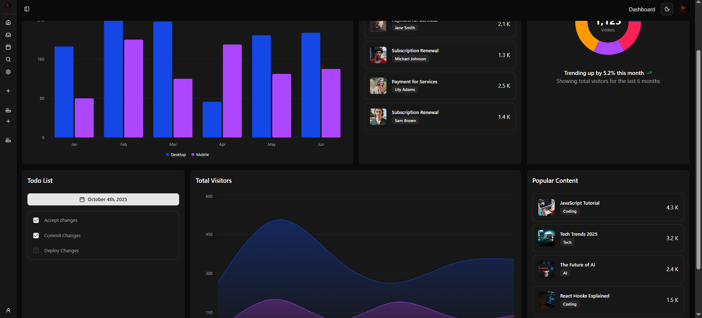

# 📊 ShadCN Dashboard

## 📖 Description

A simple dashboard built with **Next.js** and **ShadCN UI** components.  
Includes a few charts with **Chart.js** for practicing data visualization and clean UI design.

## 🔗 Demo

[Live Demo](https://dashboard-pi-ten-91.vercel.app)
[User Page](https://dashboard-pi-ten-91.vercel.app/users/userpage)
[Payment Page](https://dashboard-pi-ten-91.vercel.app/payments)



## ⚡ Installation

```bash
git clone https://github.com/salartalaa/dashboard.git
cd dashboard
npm install
npm run dev
```

## 📌 Usage

1. Clone the repository
2. Install dependencies with `npm install`
3. Run the app locally with:
   ```bash
   npm run dev
   ```
4. Open [http://localhost:3000](http://localhost:3000) in your browser

## ✨ Features

- ✅ Responsive dashboard layout
- ✅ ShadCN UI components
- ✅ Data visualization with Chart.js
- ✅ Minimalistic design

## 🛠️ Technologies

- Next.js ⚛️
- ShadCN UI 🎨
- Chart.js 📊
- Tailwind CSS 🌈

## Thanks Lama Dev Youtube Channel
